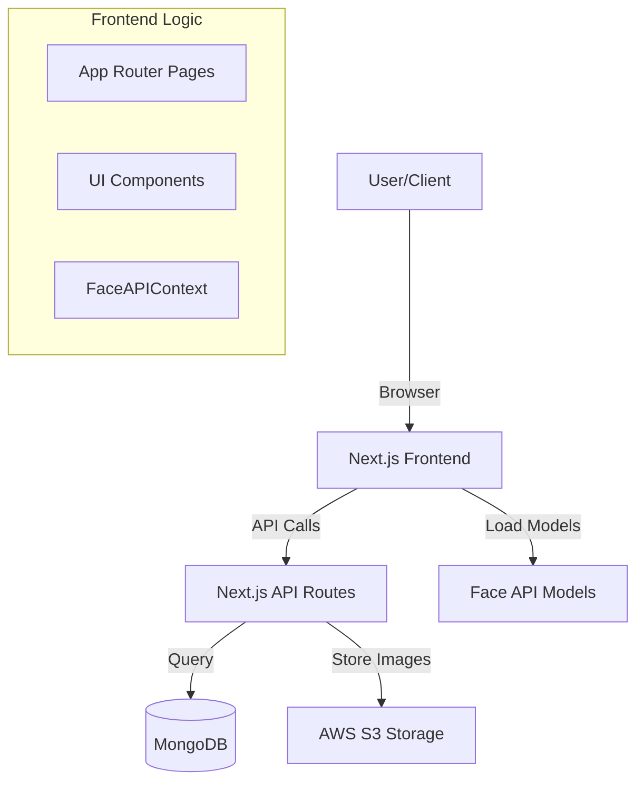
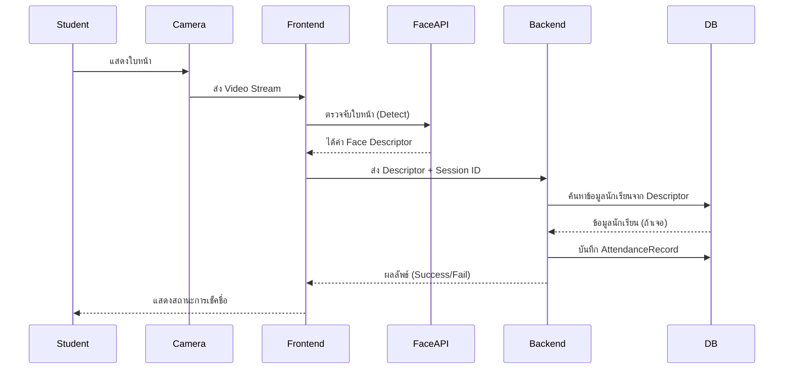

# Face recognition Attendance System - Project Documentation

## 1. Project Overview
ระบบเช็คชื่อเข้าเรียนด้วยการจำแนกใบหน้า (Face Recognition Attendance System) พัฒนาด้วย **Next.js** (App Router) เชื่อมต่อกับฐานข้อมูล **MongoDB** และใช้ **Face API** สำหรับการประมวลผลภาพใบหน้า

## 2. Technology Stack
- **Framework:** Next.js 16 (React 19)
- **Language:** TypeScript
- **Database:** MongoDB (via Mongoose)
- **Styling:** TailwindCSS 4, DaisyUI 5.5
- **Icons:** FontAwesome
- **Face Recognition:** `@vladmandic/face-api`, `@tensorflow/tfjs`
- **Authentication:** JWT, BcryptJS
- **Storage:** AWS S3 (via `@aws-sdk/client-s3`) - *Note: Based on dependencies*

## 3. Project Structure (Tree View)

โครงสร้างโฟลเดอร์หลักใน `src`:

```
src/
├── app/                  # Next.js App Router (Pages & API)
│   ├── api/              # Backend API Endpoints
│   │   ├── auth/         # Login/Register API
│   │   ├── attendance/   # Attendance Records API
│   │   ├── courses/      # Course Management API
│   │   ├── users/        # User Management API
│   │   └── ...           # Other APIs
│   ├── (routes)/         # Frontend Pages
│   │   ├── login/        # Login Page
│   │   ├── register/     # Register Page
│   │   ├── admin/        # Admin Dashboard
│   │   ├── attendance/   # Attendance Check Page
│   │   └── ...
│   └── layout.tsx        # Root Layout
├── components/           # Reusable UI Components
│   ├── students/         # Student-related components
│   ├── register/         # Registration forms
│   └── ...
├── contexts/             # React Contexts (Global State)
│   └── FaceAPIContext.tsx # Loads Face API Models globally
├── models/               # Mongoose Database Models
│   ├── User.ts
│   ├── Student.ts
│   ├── Teacher.ts
│   ├── Course.ts
│   └── AttendanceSession.ts
├── lib/                  # Library & Utility Functions
│   └── db.ts             # Database Connection (implied)
├── hooks/                # Custom React Hooks
└── types/                # TypeScript Type Definitions
```

## 4. Key Modules Description

### 4.1 Authentication (`src/app/api/auth`)
- จัดการการ Login/Register
- สร้างและตรวจสอบ JWT Token เพื่อระบุตัวตนผู้ใช้งาน
- ใช้ `bcryptjs` เข้ารหัสรหัสผ่าน

### 4.2 Face Recognition (`src/contexts/FaceAPIContext.tsx`)
- โหลดโมเดล AI ของ Face API เมื่อเริ่มแอพ
- ให้บริการฟังก์ชันตรวจจับใบหน้าแก่ Component อื่นๆ ผ่าน Context
- โมเดลที่ใช้: `ssdMobilenetv1`, `faceLandmark68Net`, `faceRecognitionNet`

### 4.3 Database Models (`src/models`)
- **User**: ข้อมูลพื้นฐานผู้ใช้ (Username, Password, Role)
- **Student/Teacher**: ข้อมูลนักเรียนและอาจารย์ที่เชื่อมโยงกับ User
- **Course**: รายวิชาที่เปิดสอน
- **AttendanceSession**: คาบเรียนที่เปิดให้เช็คชื่อ
- **AttendanceRecord**: บันทึกการมาเรียนของนักเรียนแต่ละคน

## 5. System Architecture Diagrams

### 5.1 Project Structure Diagram
แผนภาพแสดงความสัมพันธ์ของ Component หลัก



### 5.2 Attendance Flow (Work Process)
ขั้นตอนการเช็คชื่อ



## 6. สำคัญสำหรับการพัฒนาต่อ
- **Face Models**: ไฟล์โมเดลอยู่ใน `public/models` (ต้องตรวจสอบว่ามีไฟล์ครบหรือไม่)
- **Environment**: ตรวจสอบ `.env` สำหรับค่าเชื่อมต่อ MongoDB และ Secret Keys
- **API Routes**: แก้ไข Logic หลังบ้านที่ `src/app/api`
- **UI/UX**: แก้ไขหน้าตาที่ `src/app` และ `src/components` (ใช้ TailwindCSS)

